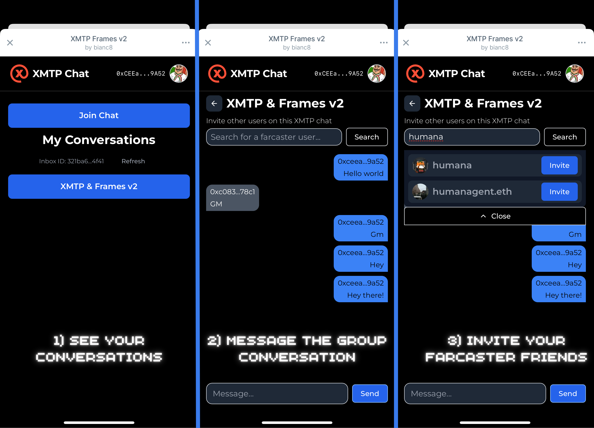

# XMTP MiniApp with Next.js

A Farcaster MiniApp with XMTP private chat example.

[](https://www.youtube.com/watch?v=tw6bDNDt-AM)

## Getting Started

This Farcaster Miniapp (Framev2) is a [Next.js](https://nextjs.org) project
bootstrapped with the
[`Builders Garden miniapp template`](https://github.com/builders-garden/miniapp-next-template),
you can find more information about the template
[here](https://frames-v2.builders.garden). For more information about Farcaster
Miniapps, you can find more information [here](https://miniapps.farcaster.xyz/).

## Prerequisites

- Node.js >=20
- Yarn @4.6.0 package manager
- A Farcaster account on your phone

## Development

Start the frontend and backend servers:

```bash
cd frontend
cp .env.example .env.local
yarn i
yarn run dev
```

```bash
cd backend
cp .env.example .env.local
yarn i
yarn run dev
```
